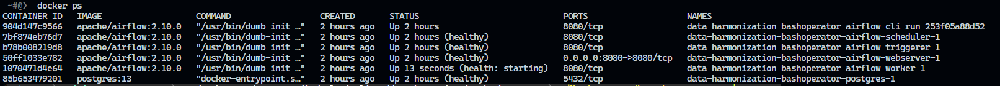
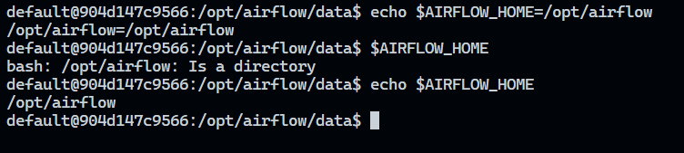

# data-harmonization-bashOperator
The job is to collect data available in different formats and consolidate it into a single file.

* [Docker + Airflow](#id1)
    * [Setting the right Airflow user](#id11)
    * [Running Airflow](#id12)
* [Airflow - Accessing the environment](#id2)
    * [Running the CLI commands](#id21)
    * [Accessing the web interface](#id22)
* [Setup the environment](#id3)


## Docker + Airflow <a name="id1"></a>

From: [Running Airflow in Docker](https://airflow.apache.org/docs/apache-airflow/stable/howto/docker-compose/index.html#running-the-cli-commands).

### Setting the right Airflow user <a name="id11"></a>

On Linux, the quick-start needs to know your host user id and needs to have group id set to 0. Otherwise the files created in dags, logs and plugins will be created with root user ownership. You have to make sure to configure them for the docker-compose:

```
mkdir -p ./dags ./logs ./plugins ./config
echo -e "AIRFLOW_UID=$(id -u)" > .env
```

For other operating systems, you may get a warning that AIRFLOW_UID is not set, but you can safely ignore it. You can also manually create an .env file in the same folder as docker-compose.yaml with this content to get rid of the warning:

```
AIRFLOW_UID=50000
```

### Running Airflow <a name="id12"></a>

Now you can start all services:

```
docker compose up
```

In a second terminal you can check the condition of the containers and make sure that no containers are in an unhealthy condition:




### Cleaning up <a name="id23"></a>

To stop and delete containers, delete volumes with database data and download images, run:

```
docker compose down --volumes --rmi all
```

## Airflow - Accessing the environment <a name="id2"></a>

From [Airflow - Running the CLI commands](https://airflow.apache.org/docs/apache-airflow/stable/howto/docker-compose/index.html#running-the-cli-commands:~:text=REST%20API.-,Running%20the%20CLI%20commands,-You%20can%20also):

### Running the CLI commands <a name="id21"></a>

You can also run CLI commands, but you have to do it in one of the defined airflow-* services. For example, to run airflow info, run the following command:

```
docker compose run airflow-worker airflow info
```

If you have Linux or Mac OS, you can make your work easier and download a optional wrapper scripts that will allow you to run commands with a simpler command.

```
curl -LfO 'https://airflow.apache.org/docs/apache-airflow/2.10.1/airflow.sh'
chmod +x airflow.sh
```

Now you can run commands easier.

```
./airflow.sh info
```

You can also use bash as parameter to enter interactive bash shell in the container or python to enter python container.

```
./airflow.sh bash
```

```
./airflow.sh python
```

### Accessing the web interface <a name="id22"></a>

Once the cluster has started up, you can log in to the web interface and begin experimenting with DAGs.

The webserver is available at: http://localhost:8080. The default account has the login airflow and the password airflow.


## Setup the environment <a name="id3"></a>

1. Open a terminal and run the command below to set the AIRFLOW_HOME.

```
export AIRFLOW_HOME=/opt/airflow
echo $AIRFLOW_HOME
```



2. Download the data set from the source to the following destination using the curl command.

```
curl https://cf-courses-data.s3.us.cloud-object-storage.appdomain.cloud/IBM-DB0250EN-SkillsNetwork/labs/Final%20Assignment/tolldata.tgz -o $AIRFLOW_HOME/data/tolldata.tgz
```
***